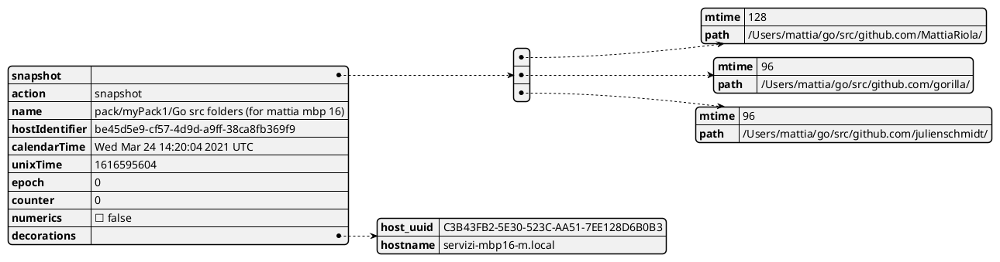
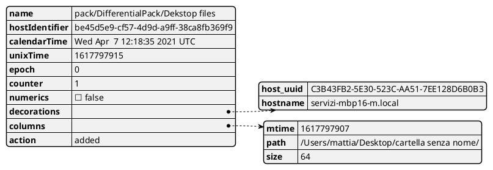
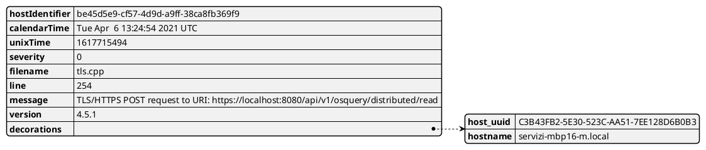
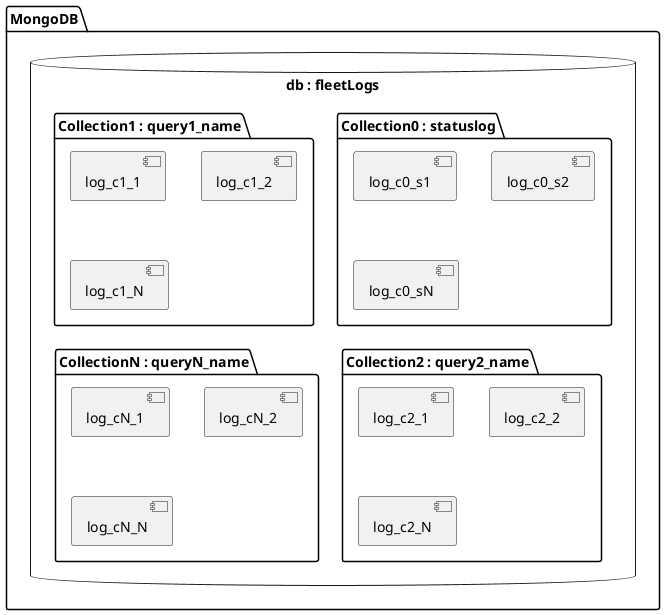

## JSON structure for scheduled logs

#### snapshot logs
###### standard snapshot log:
example:

###### cached snapshot logs:
this is the json that fleet receives when the agent loses the connection with the server (and the agent continues its scheduled queries)
Issue: the final "json" is the concatenation of stardard scehduled queries without delimeters

```plantuml
@startjson
{
{
        "snapshot": [
            {
                "mtime": "128",
                "path": "/Users/mattia/go/src/github.com/MattiaRiola/"
            },
            {
                "mtime": "96",
                "path": "/Users/mattia/go/src/github.com/gorilla/"
            },
            {
                "mtime": "96",
                "path": "/Users/mattia/go/src/github.com/julienschmidt/"
            }
        ],
        "action": "snapshot",
        "name": "pack/myPack1/Go src folders (for mattia mbp 16)",
        "hostIdentifier": "be45d5e9-cf57-4d9d-a9ff-38ca8fb369f9",
        "calendarTime": "Wed Mar 24 14:37:01 2021 UTC",
        "unixTime": 1616596621,
        "epoch": 0,
        "counter": 0,
        "numerics": false,
        "decorations": {
            "host_uuid": "C3B43FB2-5E30-523C-AA51-7EE128D6B0B3",
            "hostname": "servizi-mbp16-m.local"
        }
    },
    {
        "snapshot": [
            {
                "count(*)": "11"
            }
        ],
        "action": "snapshot",
        "name": "pack/myPack1/number of chrome processes",
        "hostIdentifier": "be45d5e9-cf57-4d9d-a9ff-38ca8fb369f9",
        "calendarTime": "Wed Mar 24 14:37:01 2021 UTC",
        "unixTime": 1616596621,
        "epoch": 0,
        "counter": 0,
        "numerics": false,
        "decorations": {
            "host_uuid": "C3B43FB2-5E30-523C-AA51-7EE128D6B0B3",
            "hostname": "servizi-mbp16-m.local"
        }
    },
    {
        "snapshot": [
            {
                "build_distro": "10.12",
                "build_platform": "darwin",
                "config_hash": "21eb349f9782b21d6f17a9696701905abdfbfb99",
                "config_valid": "1",
                "extensions": "active",
                "instance_id": "be45d5e9-cf57-4d9d-a9ff-38ca8fb369f9",
                "pid": "31381",
                "platform_mask": "21",
                "start_time": "1616577617",
                "uuid": "C3B43FB2-5E30-523C-AA51-7EE128D6B0B3",
                "version": "4.5.1",
                "watcher": "31380"
            }
        ],
        "action": "snapshot",
        "name": "pack/myPack1/osquery info",
        "hostIdentifier": "be45d5e9-cf57-4d9d-a9ff-38ca8fb369f9",
        "calendarTime": "Wed Mar 24 14:37:16 2021 UTC",
        "unixTime": 1616596636,
        "epoch": 0,
        "counter": 0,
        "numerics": false,
        "decorations": {
            "host_uuid": "C3B43FB2-5E30-523C-AA51-7EE128D6B0B3",
            "hostname": "servizi-mbp16-m.local"
        }
    }
}
@endjson
```

#### differential logs

When a differential query is sent for the first time the query response is made of a sequence of "added" type log in order to have the initial state.

note: action can be "added" or "removed"

#### status logs
example:

# Structure of log mongodb solution A

