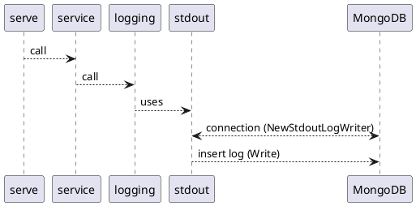
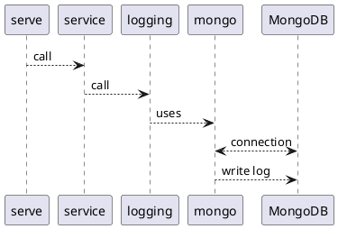

### Sequence diagram scheduled logging in fleet

##### v0.1.0:
1. fleet - mongoDB connection
2. everytime fleet writes logs in stdout it writes logs in mongoDB 

##### v0.2.0:
0. checking the configuration
1. fleet - mongoDB connection
2. fleet writes logs in mongoDB

